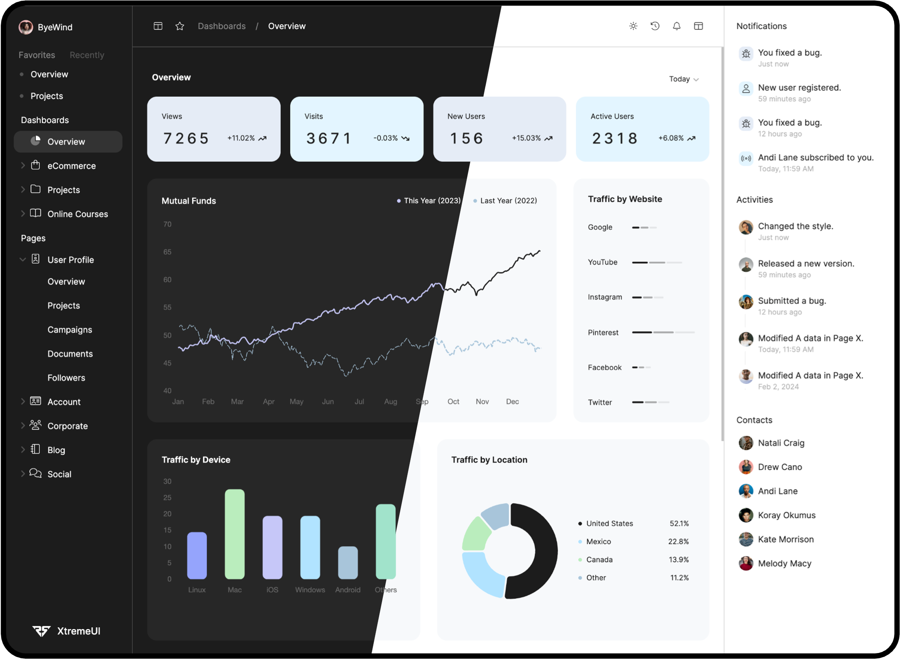

<br>

# ❄️ SnowBoard - A Beautiful Dashboard Experience ❄️

Welcome to the Snow UI Dashboard clone! Inspired by the mesmerizing [Snow UI Dashboard](https://snowui.framer.website/),
this project aims to replicate the elegant design and functionality of the original.
Unleash the power of a dynamic dashboard template that gives you more control and flexibility.

[👉 Check out the Live Demo!](http://snowboard.ritik.me)

## ✨ Features
- Multi Screen Size Support
- Light and Dark Theme Switcher
- FontAwesome Icon Support
- Responsive Charts
- And many more...

## 💻 Built With

- [Next.js](https://nextjs.org/) - The React Framework
- [SCSS](https://sass-lang.com/) - CSS with superpowers
- [Chart.js](https://www.chartjs.org/) - Simple, clean and engaging charts for designers and developers

### 🚀 Getting Started

1. Clone the repository to your local machine.
2. Navigate into the project directory.
3. Install the necessary dependencies:
```
npm install
yarn install
pnpm install
```
4. To run the application in development mode:
```
npm run dev
yarn dev
pnpm dev
```

Now, open your favorite browser and enter `http://localhost:3000` in the search bar.

Enjoy the snowfall! ❄️

## 😊 Acknowledgements

The current dashboard is greatly inspired by the elegant and intuitive design found at [Snow UI Dashboard](https://snowui.framer.website/).
Please note, we do not hold ownership or rights over SnowUI.